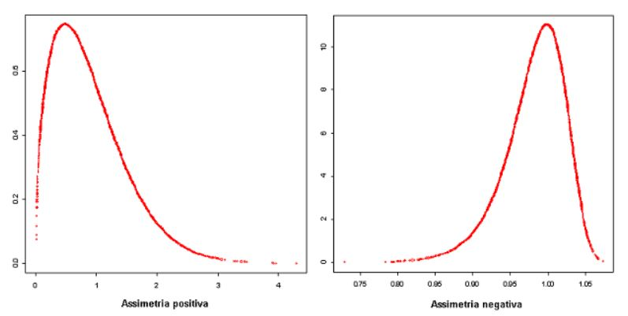
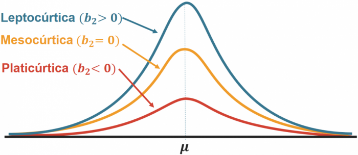

# Análise de um Portfólio de Ações (Dashboard com R)
Esse projeto é um [dashboard interativo](https://augustoleal.shinyapps.io/Portf_Analysis_ACL/) onde é possível analisar um portfólio de até **5** ativos, a partir de 4 visões (**retorno**, **desvio padrão**, **assimetria** e **curtose**).

 Todo o dashboard foi construído com a linguagem R, usando as ferramentas:
- **Shiny** (Reatividade do Dashboard)
- **Flexdashboard** (Template Rápido de Dashboards)
- **Highcharter** (Visualização Gráfica em JavaScript)
- **Tidyquant** (Pacote R que traz dados do *Yahoo Finance*)

Objetivo do projeto foi gerar conjunto de visualizações relevantes para uma análise descritiva de um portfólio, utilizando os conhecimentos aprendidos no livro [Reproducible Finance with R](http://www.reproduciblefinance.com/). 
Como esta é uma aplicação dos conhecimentos do livro, sinta-se a vontade para utilizá-la como complemento ao conteúdo do livro e seus estudos pessoais. 

Aproveite a interatividade dos gráficos no dashboard e experimente os filtros de tempo, gráficos reativos e outras funcionalidades que o [Highcharter](http://jkunst.com/highcharter/) disponibiliza para aperfeiçoar a sua análise.  

# INPUTS
**TICKER**: Como o dash se alimenta com dados do [Yahoo Finance](https://finance.yahoo.com/), todos os ativos da plataforma podem ser adicionados ao dashboard e, portanto, devem cumprir o padrão de ticker do mesmo.

Ação Brasileira | Ação Americana
--------------- | ----------------
**WEGE3\.SA** (WEG) | **SBUX** (Starbucks)

O portfólio padrão carrega os tickers `WEGE3.SA`, `RENT3.SA`, `VALE3.SA`, `PETR4.SA` e `ITUB4.SA`. Caso algum ticker não seja mais encontrado no Yahoo Finance, o dashboard exibe um aviso indicando qual ativo remover ou corrigir.

Em caso de dúvidas do ticker correto, acesse o [Yahoo Finance](https://finance.yahoo.com/) para a captura dos ativos desejados.

**PESOS**: Certifique-se de que os pesos somem 100% para que os cálculos do dashboard sejam efetuados. Para isso, o botão 'Calcular' fica disponível somente quando os pesos somam 100%.

**DATAS**: O período de análise é definido automaticamente como uma janela móvel de 3 anos: a data final é o último dia do mês anterior e a data inicial é 3 anos antes. Você ainda pode ajustar as datas manualmente, mas atente-se para que todas as 5 ações estejam disponíveis no período selecionado.

**PERIODICIDADE e JANELA MÓVEL**: Utilize estas opções para detalhar sua análise. Os log-retornos serão analisados de acordo com a periodicidade selecionada (anual, mensal e semanal) e a janela móvel te permite observar o comportamento histórico de medidas de risco do portfólio, como desvio padrão, assimetria e curtose. 

# Resumo das 4 visões
**Log-Retornos**: Para avaliarmos as distribuições históricas dos retornos, é necessário utilizar o `log-retorno` para equalizar os pesos para os retornos reais positivos e negativos. Acesse esse [link](http://ferramentasdoinvestidor.com.br/dicas-de-excel/entenda-o-log-retorno/) para uma maior compreensão do uso necessário do log-retorno na avaliação de retornos acumulados.  

**Desvio Padrão**:  Indica o grau de dispersão dos log-retornos dos ativos em relação a sua média. Quanto maior o desvio padrão, mais volátil (risco) é o log-retorno do ativo.

**Assimetria**: Descrever o comportamento histórico dos retornos através da assimetria de sua distribuição em relação a média. Como a média dos log-retornos tendem a zero, assimetria negativa indica forte presença de retornos positivos, enquanto assimetria positiva indica grandes retorno negativos. 

**Curtose**: Descreve a intensidade de valores extremos na distribuição de retornos.Curtose alta significa recorrência de retornos extremos no histórico do ativo.

Obs.: Ilustrações retiradas do [Portal Action](http://www.portalaction.com.br/)

# Lista de Melhorias
- [ ] Permitir o input de 4 ativos ou menos no portfólio.
- [ ] Permitir o input 5 ativos ou mais no portfólio.
- [ ] Permitir o cálculo do portfólio em intervalos de tempo que algum  ativo não esteja disponível.
- [ ] Adicionar novas páginas contendo CAPM, Sharpe Ratio e Frama-French Model
- [ ] Refazer o Dashboard utilizando **Shiny** ou **Shinydashboard**.
- [ ] Modularizar o dash para organizar o script, com um módulo para cada página.
- [ ] Construir o app usando **Golem** para colocar o app em produção utilizando um container (**docker**)  em alguma nuvem na web. 

Obs.: A sequência das melhorias não indica ordem de prioridades.